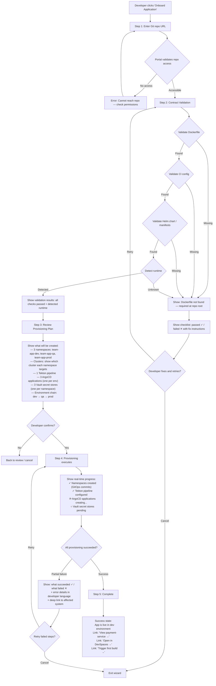
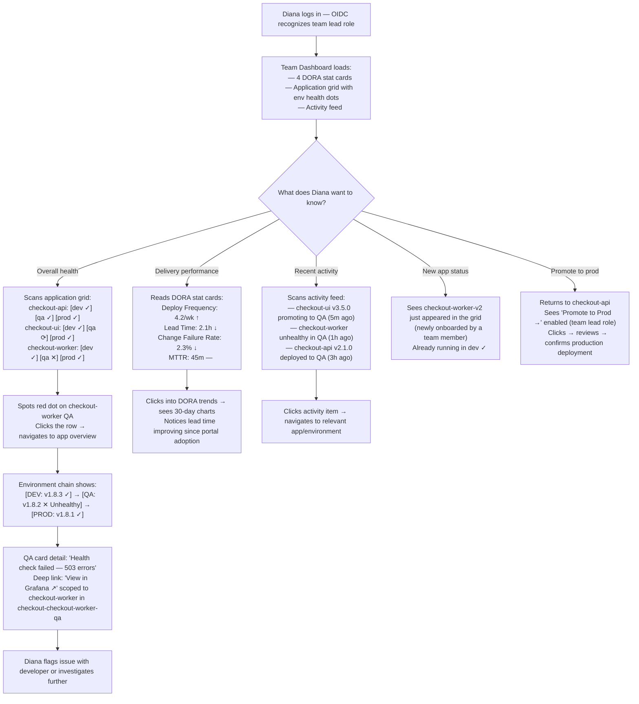

```mermaid
flowchart TD
    A[Marco logs in — OIDC auto-recognized] --> B[Lands on team view — sees his applications]
    B --> C[Selects 'orders-api' — sees environment chain]

    C --> D["Environment Chain (Card View):
    [DEV: v2.1.0 ✓] → [QA: v2.0.9 ✓] → [PROD: v2.0.8 ✓]"]

    D --> E{What does Marco want to do?}

    E -->|Build new code| F[Clicks 'Trigger Build']
    F --> G["Build starts — inline status in chain:
    ⟳ Building #143..."]
    G --> H{Build result}
    H -->|Failed| I["Build row turns red:
    ✕ Failed — Stage: Unit Tests
    'View Logs' link + 'Open in Tekton ↗'"]
    I --> J[Marco fixes code, triggers new build]
    J --> G
    H -->|Passed| K["Build #143 passed ✓
    Image: registry/orders/api:2.1.1
    'Create Release' button appears inline"]

    K --> L[Clicks 'Create Release']
    L --> M["Release v2.1.1 created
    (Git tag + container image associated)"]

    M --> N["Chain updates — DEV shows:
    'Deploy v2.1.1' button"]
    N --> O[Clicks 'Deploy to Dev']
    O --> P["Dev card shows: ⟳ Deploying v2.1.1...
    (ArgoCD sync in progress)"]
    P --> Q{Deploy result}
    Q -->|Failed| R["Dev card turns red:
    ✕ Deploy failed — health check timeout
    'View in ArgoCD ↗' deep link"]
    Q -->|Success| S["Dev card turns green:
    ✓ Healthy — v2.1.1
    'Promote to QA →' button appears"]

    S --> T[Marco clicks 'Promote to QA →']
    T --> U["Confirmation: 'Deploy v2.1.1 to QA?'
    (shows: orders-orders-api-qa on ocp-qa-01)"]
    U --> V[Confirms]
    V --> W["QA card shows: ⟳ Deploying v2.1.1..."]
    W --> X{QA deploy result}
    X -->|Success| Y["QA card turns green: ✓ Healthy — v2.1.1
    'Promote to Prod →' button appears"]

    Y --> AA{Is Marco a team lead?}
    AA -->|No| AB["'Promote to Prod →' disabled
    Tooltip: 'Production deployments require team lead approval'"]
    AA -->|Yes| AC[Clicks 'Promote to Prod →']
    AC --> AD["Confirmation with extra emphasis:
    'Deploy v2.1.1 to PRODUCTION?'
    Shows: orders-orders-api-prod on ocp-prod-01
    Requires explicit confirmation"]
    AD --> AE[Confirms]
    AE --> AF["Prod card shows: ⟳ Deploying v2.1.1..."]
    AF --> AG{Prod deploy result}
    AG -->|Success| AH["All three cards green:
    [DEV: v2.1.1 ✓] → [QA: v2.1.1 ✓] → [PROD: v2.1.1 ✓]
    Marco is done."]
```

---
stepsCompleted:
  - 1
  - 2
  - 3
  - 4
  - 5
  - 6
  - 7
  - 8
  - 9
  - 10
  - 11
  - 12
  - 13
  - 14
inputDocuments:
  - 'planning-artifacts/prd.md'
  - 'planning-artifacts/product-brief.md'
  - 'planning-artifacts/product-brief-distillate.md'
---

# UX Design Specification - Internal Developer Portal

**Author:** Raffa
**Date:** 2026-03-30

---

## Executive Summary

### Project Vision

The Internal Developer Portal is a self-service web application that unifies the full application lifecycle — onboarding, coding, building, deploying, and observing — into a single developer-centric interface for the Red Hat/OpenShift platform stack. It replaces navigation across 6+ disparate tool UIs with a coherent abstraction layer that speaks in developer concepts: applications, builds, deployments, and releases.

The portal is desktop-first, on-premises, built as a stateless SPA + REST API using PatternFly components. Adoption is voluntary — the UX must earn usage by delivering undeniable productivity gain over the tool-switching status quo.

### Target Users

**Application Developers (Primary)**
Senior and mid-level developers who write code and ship features daily. Highly tech-savvy in their application domain, but should not need to learn infrastructure vocabulary (Kubernetes resources, GitOps repos, Vault paths). They currently lose significant time context-switching across 6+ platform tools. They will use the portal on desktop workstations via modern evergreen browsers.

**Development Team Leads (Secondary)**
Manage multiple applications and developers. Need cross-environment portfolio visibility — deployment status, team activity, health, and DORA metric trends — without opening individual platform tools. Their primary mode is monitoring and decision-making, not task execution.

**Platform Engineering Team (Downstream)**
Benefit from reduced ticket volume as self-service adoption grows. Not direct portal users for MVP, but their operational burden is a key success metric.

### Key Design Challenges

1. **Complexity-to-simplicity translation** — The portal orchestrates 9 platform systems. The UX must present simple developer workflows while surfacing failures clearly and without infrastructure jargon. This is the hardest UX problem in the product.

2. **Information density without overwhelm** — Team leads need cross-environment, cross-application visibility. Developers need focused, task-oriented views. The same data must serve different information needs through careful information hierarchy.

3. **Progressive disclosure at the portal boundary** — Deep links to native tools (Tekton, ArgoCD, Grafana, Vault) are first-class features. The UX must make the transition between portal abstraction and native tool seamless and intentional, not jarring.

4. **Onboarding flow confidence** — Application onboarding triggers real infrastructure changes across multiple systems. The UX must build trust through clear preview, execution feedback, and unambiguous success/failure indication.

### Design Opportunities

1. **End-to-end lifecycle flow as the adoption driver** — The onboard → code → build → release → deploy → verify health flow should feel like a guided, almost inevitable progression. Nailing this flow with minimal friction is the single most powerful adoption mechanism.

2. **Environment chain as a signature visual element** — The promotion chain (dev → qa → staging → prod) visualized with release position, health, version, and deployment status creates at-a-glance understanding no individual tool provides today.

3. **PatternFly as a UX accelerator** — Mature, accessible component library with built-in patterns for dashboards, data tables, wizards, and status indicators — all directly applicable. Enables fast implementation with Red Hat ecosystem consistency.

## Core User Experience

### Defining Experience

The portal's core experience centers on two complementary interactions:

**The daily development loop** is the highest-frequency flow — developers check application status across environments, trigger builds, create releases, and promote deployments through the environment chain. This is where the portal must feel effortless and fast, keeping developers in flow rather than forcing them into tool-switching.

**Application onboarding** is the highest-stakes flow — the first time a developer sees the portal deliver real infrastructure value. A successful onboarding (Git repo to running in dev, zero tickets, minutes not days) is the trust-building moment that converts a skeptic into an advocate.

The gravitational center of the entire UX is the **environment chain visualization** — a view that shows where each release sits across the promotion chain (dev → qa → staging → prod), with health, version, and deployment status at a glance, and direct action affordances for deployment and promotion. If this view works, it becomes the natural home for both daily development work and team lead oversight.

### Platform Strategy

- **Desktop-first SPA** — mouse/keyboard primary interaction, optimized for developer workstations
- **PatternFly component framework** — Red Hat ecosystem alignment, built-in accessibility (WCAG 2.1 AA), mature patterns for dashboards, tables, wizards, and status indicators
- **Evergreen browsers only** — Chrome, Firefox, Edge; no legacy browser support
- **Live state, no offline** — every view fetches current state from source-of-truth platform systems; no offline capability required
- **No mobile/tablet optimization** for MVP; functional at standard desktop and laptop resolutions
- **SPA client-side routing** — near-instant navigation between views, no full page reloads

### Effortless Interactions

The following interactions must require zero cognitive effort:

| Interaction | Effortless Standard |
|---|---|
| Orientation | Landing on any view immediately shows where your app is and its state across all environments |
| Promotion | Moving a release to the next environment is a single confident action with clear preview |
| Status comprehension | Build pass/fail, deployment healthy/unhealthy, sync status — all glanceable, not investigative |
| Team/app navigation | Switching between team applications without losing mental context |
| Deep linking out | One click lands in the exact right place in the native tool, scoped to the resource in context |

### Critical Success Moments

1. **First onboarding (the "aha moment")** — Developer registers an app, sees the onboarding plan, confirms, and watches namespaces, pipelines, ArgoCD, and Vault materialize in minutes. This is where the portal earns permanent trust.

2. **First end-to-end flow** — Build → release → deploy to dev → promote to QA → verify health. The moment a developer realizes they completed the entire workflow without opening another tool.

3. **First failure handled well** — A pipeline fails or an environment is unhealthy. The portal shows it clearly, in developer language, with a path to resolution. Trust is built not just when things work, but when failures are transparent.

4. **Team lead's first portfolio view** — All applications visible, health across environments, recent activity, DORA trends — the realization that ArgoCD and Grafana no longer need to be opened separately.

### Experience Principles

1. **Developer language, always.** Every label, status, and message speaks in applications, builds, releases, and environments — never in Kubernetes resources, GitOps repos, or Vault paths.

2. **Orientation before action.** Every view answers "where am I, what's the state?" before asking the user to do anything. The environment chain is the primary orientation device.

3. **Confidence through preview.** Any action that triggers real infrastructure changes shows what will happen before the user commits. No surprises.

4. **Failures are first-class.** Errors and unhealthy states are surfaced prominently, explained in developer terms, and paired with a clear next step. Silent failures are forbidden.

5. **Progressive escape, not a cage.** The portal is the happy path, not a wall. Deep links to native tools are immediate, scoped, and contextual. Users never feel trapped.

## Desired Emotional Response

### Primary Emotional Goals

**Empowered and in control** — Developers feel they have full command of their application lifecycle. The portal is their tool, not a gatekeeping system they must appease. Every action feels like a decision they're making, not a form they're submitting.

**Relief** — "I never have to open six tools again." The cumulative weight of tool-switching, context-switching, and cognitive load is lifted. The portal is the single place where the whole picture lives.

**Informed confidence** — Even when things go wrong, developers know exactly what happened, in terms they understand, with a clear path to resolution. No anxiety, no helplessness, no ambiguity.

### Emotional Journey Mapping

| Stage | Desired Emotion | Design Implication |
|---|---|---|
| First login | Instant recognition — "this knows who I am and my team" | OIDC auto-recognition, team context pre-loaded, no setup |
| First onboarding | Surprise at simplicity — "that's it? No tickets?" | Clear preview → confirm → fast execution → unambiguous success |
| Daily use | Calm focus — everything in one place, no ambient load | Consistent layout, environment chain as home base, glanceable status |
| Triggering builds/deployments | Confidence — "I know what this will do" | Preview of action, clear in-progress state, definitive result |
| Something fails | Informed confidence — "I see what broke and what to do" | Developer-language errors, clear severity, actionable next step or deep link |
| Returning after time away | Quick re-orientation — "I can see where everything stands" | Environment chain visualization, recent activity, health at a glance |
| Team lead checking portfolio | Clarity and satisfaction — "my team is shipping" | Aggregated health, DORA trends, activity feed, no tool-hopping |

### Micro-Emotions

**Critical to cultivate:**
- **Confidence over confusion** — Every interaction should reinforce that the user understands what's happening. Labels, statuses, and confirmations in developer language, never infrastructure jargon.
- **Trust over skepticism** — The portal shows live state from source-of-truth systems. What you see is what's real. No stale data, no "is this current?" doubt.
- **Accomplishment over frustration** — Completing a workflow (onboard, build, deploy, promote) should feel like a clear achievement, not a relief that it didn't break.

**Critical to prevent:**
- **Anxiety** — "Did it work? Is it still running? What did I just trigger?" Eliminated through explicit state transitions and unambiguous feedback.
- **Helplessness** — "Something broke and I don't know why or what to do." Eliminated through developer-language errors with actionable next steps.
- **Distrust** — "Is this data current? Can I rely on this view?" Eliminated through live state fetching and clear loading/error states when a source system is unreachable.

### Design Implications

| Emotional Goal | UX Design Approach |
|---|---|
| Empowered and in control | Direct action affordances on every view — deploy, promote, trigger build — not buried in menus. Users act, not request. |
| Relief from tool-switching | Unified navigation, consistent information architecture, environment chain as the connective tissue across all workflows |
| Informed confidence on failure | Inline error states with developer-language explanation, severity indication, and one-click deep link to the native tool for investigation |
| Surprise at simplicity (onboarding) | Wizard pattern with clear steps, real-time provisioning progress, celebration state on completion |
| Calm focus (daily use) | Minimal chrome, information density without clutter, consistent layout patterns, no unnecessary animations or distractions |
| Trust in data freshness | Visible "last refreshed" indicators where relevant, clear loading states, explicit error when a source system is unreachable |

### Emotional Design Principles

1. **Competence, not hand-holding.** The portal treats developers as experts in their domain. It provides information and affordances, not tutorials or excessive guardrails. The tone is peer-to-peer, not system-to-supplicant.

2. **Transparency builds trust.** Show real state, show when data is loading, show when a system is down. Never fake success or hide failure. Developers trust tools that are honest about their limitations.

3. **Celebrate the wins quietly.** Successful onboarding, green health across environments, improving DORA trends — these should feel good without being noisy. A clear success state, not confetti. The satisfaction comes from the outcome, not the animation.

4. **Errors are conversations, not dead ends.** Every error message should answer three questions: What happened? Why? What can I do about it? If the portal can't resolve it, it points to who or what can.

## UX Pattern Analysis & Inspiration

### Inspiring Products Analysis

#### Domain Inspiration: Internal Developer Platforms

**Humanitec**
- Excels at environment modeling and deployment visualization — environments as first-class objects with clear promotion paths between them
- Score-based application readiness indicators give quick health assessment
- Resource dependency graphs show what's connected to what — useful mental model for complex platform relationships
- Clean separation between "what developers see" (application, environment, deployment) and "what the platform does" (Kubernetes resources, drivers, orchestration)
- Weakness: resource graph complexity can overwhelm when the dependency tree is deep; the abstraction sometimes leaks infrastructure concepts

**Port**
- No-code blueprint approach makes self-service actions feel lightweight and approachable — "click to provision" rather than "fill out a form"
- Catalog views with customizable columns let different personas (dev vs. lead) see what matters to them
- Scorecard system provides at-a-glance quality and compliance signals per service
- Action-oriented UI — services aren't just listed, they have clear affordances for what you can do with them
- Weakness: flexibility comes at the cost of opinionatedness; the "build your own portal" model requires significant configuration before value emerges

**Cortex**
- Service catalog with ownership clarity — immediately obvious who owns what
- Scorecard approach to service maturity gives team leads a portfolio health view
- Integration cards show the status of each connected system cleanly
- Weakness: catalog-first orientation means the CI/CD execution and inner-loop experience feels bolted on rather than native

**Key domain takeaways for the Internal Developer Portal:**
- Environment chain as a visual first-class concept (Humanitec's strongest pattern)
- Action affordances directly on catalog/list views — don't make users drill in just to act (Port's pattern)
- Scorecard/health indicators at the portfolio level for team leads (Cortex's pattern)
- But unlike all three: our portal owns the full lifecycle natively, so CI/CD and deployment aren't integrations — they're core flows

#### UI/UX Presentation Inspiration: Clean & Terse Developer Interfaces

**GitHub**
- Master of information density without clutter — repository pages pack enormous amounts of data (branches, commits, actions, issues, PRs) into a scannable layout
- Consistent visual language: status badges (green check, red X, yellow dot) are universally understood at a glance
- Progressive disclosure done right: summary → detail drilldown, with the summary being sufficient for 80% of needs
- Terse, developer-friendly copy — labels and messages are short, precise, and assume competence
- Tab-based navigation within a resource context (Code, Issues, PRs, Actions, Settings) keeps related views grouped without losing context
- Action status (GitHub Actions) shows pipeline runs with minimal chrome: commit message, status icon, duration, and a click to expand

**GitLab**
- Pipeline visualization is a standout — stages rendered as a horizontal flow with job status per stage, immediately readable
- Merge request pages balance code diff, CI status, approval state, and deployment environments in one view without feeling overloaded
- Environment pages show deployment history per environment with version, status, and rollback affordance — directly analogous to our environment chain
- Consistent sidebar navigation with contextual breadcrumbs maintains orientation across deep hierarchies (group → project → pipeline → job)
- Operations dashboards aggregate health and deployment data across projects — maps to our team lead portfolio view
- Terse, no-nonsense visual style — functional over decorative, respects developer time

### Transferable UX Patterns

**Navigation Patterns:**
- **Tab-based contextual navigation** (GitHub) — within an application context, tabs for Overview, Builds, Releases, Environments, Settings. Keeps all application views grouped without losing the application context.
- **Sidebar + breadcrumb orientation** (GitLab) — persistent sidebar for team/application switching, breadcrumbs for depth (Team → Application → Environment → Deployment). Developers always know where they are.

**Information Display Patterns:**
- **Status badge vocabulary** (GitHub) — a small, consistent set of status indicators (success/green, failure/red, in-progress/yellow, unknown/grey) used universally across builds, deployments, and health. Glanceable, no legend needed.
- **Pipeline stage visualization** (GitLab) — horizontal flow of stages with per-stage status. Directly applicable to our CI pipeline monitoring view.
- **Summary-first with drilldown** (GitHub) — every list view shows the essential info (name, status, timestamp, key metadata). Clicking expands to full detail. 80% of tasks resolved from the summary level.

**Action Patterns:**
- **Inline action affordances** (Port) — deploy, promote, trigger build available directly on the resource row or card, not buried in a detail page or dropdown menu.
- **Environment deployment history with rollback** (GitLab) — each environment shows what's deployed, when, by whom, with a clear rollback action. Directly maps to our environment chain view.

**Portfolio Patterns:**
- **Operations dashboard aggregation** (GitLab) — team-level view aggregating status across multiple projects/applications. Maps to Diana's team lead view.
- **Scorecard indicators** (Port/Cortex) — per-application health/readiness signals visible at the list level. Useful for team lead portfolio scanning.

### Anti-Patterns to Avoid

1. **Infrastructure language leaking into developer views** — ArgoCD's UI is powerful but speaks in Kubernetes manifests, sync states, and resource trees. Our portal must never show "Application out of sync" without translating it to "Deployment pending — version X.Y not yet live in QA."

2. **Configuration-before-value** — Port's flexibility requires significant blueprint setup before developers see value. Our portal must deliver value on first use — OIDC login, team recognized, applications visible. Zero configuration for the developer.

3. **Catalog-first, action-second** — Cortex and Backstage present a service catalog where you browse, then separately figure out how to act. Our portal is action-first: the environment chain view isn't just informational, it's where you deploy, promote, and verify.

4. **Dashboard sprawl** — Grafana is phenomenally powerful but overwhelms with dashboard proliferation and query-building complexity. Our observability views must be opinionated and pre-configured: DORA metrics and golden signals per app per environment, no dashboard building required.

5. **Modal overload for simple actions** — enterprise tools love confirmation modals for every action. Reserve modals for genuinely destructive or irreversible actions (production deployment). Routine actions (trigger dev build, promote to QA) should be fast, with undo or clear status feedback instead of pre-action gates.

6. **Stale data without indication** — if a view shows cached or potentially stale data (e.g., a source system was unreachable), it must say so visibly. Developers lose trust in portals that show confidently wrong data.

### Design Inspiration Strategy

**Adopt directly:**
- GitHub/GitLab status badge vocabulary (success, failure, in-progress, unknown) as the universal status language
- GitLab pipeline stage visualization for CI pipeline monitoring
- GitHub summary-first list views with drilldown for all resource lists (applications, builds, releases)
- GitLab environment deployment history pattern for environment chain views

**Adapt for our context:**
- GitHub tab-based navigation adapted for our domain model: application-level tabs (Overview, Builds, Releases, Environments, Health, Settings)
- GitLab operations dashboard adapted as team lead portfolio view with DORA trends and cross-app health
- Port inline action affordances adapted to our environment chain — promote, deploy, rollback directly on the environment row
- Humanitec environment modeling adapted with our promotion chain concept — linear flow visualization with health and version per stage

**Deliberately avoid:**
- ArgoCD-style resource tree views — too infrastructure-oriented for our developer audience
- Backstage/Port configuration-heavy setup — zero developer configuration required
- Grafana-style dashboard building — pre-built, opinionated observability views only
- Modal-heavy confirmation patterns for routine non-destructive actions

## Design System Foundation

### Design System Choice

**PatternFly 5** — Red Hat's open source design system, purpose-built for enterprise application UIs.

PatternFly is not a generic option among alternatives — it is the only design system that aligns with all project constraints simultaneously: Red Hat ecosystem familiarity, enterprise dashboard patterns, built-in accessibility, information-dense aesthetic, and side-project velocity requirements.

### Rationale for Selection

| Factor | PatternFly Fit |
|---|---|
| Ecosystem alignment | Native to Red Hat/OpenShift — developers recognize patterns from OpenShift Console |
| Component coverage | Data tables, status indicators, wizards, cards, dashboards, navigation — 80%+ of portal views covered out of the box |
| Accessibility | WCAG 2.1 AA compliance built in — no additional accessibility work for standard components |
| Visual style | Functional, terse, information-dense — matches the GitHub/GitLab-inspired clean UI target |
| Development velocity | Side project constraint demands maximum leverage from existing components; PatternFly eliminates custom design for most UI elements |
| Charting | Victory-based chart components included — applicable to DORA metrics and health trend visualizations |
| Maintenance | Actively maintained by Red Hat with regular releases; community and documentation mature |

### Implementation Approach

**PatternFly as the foundation layer** — all standard UI elements (navigation, tables, forms, modals, alerts, status indicators, cards, tabs, breadcrumbs) use PatternFly components directly with minimal customization.

**Custom compositions for signature views** — the portal's differentiating views are built by composing PatternFly primitives into domain-specific layouts:

1. **Environment chain visualization** — composed from PatternFly cards, labels, status icons, and progress indicators arranged in a custom horizontal promotion flow layout
2. **Pipeline stage flow** — composed from PatternFly step/progress components adapted into a GitLab-inspired horizontal stage visualization
3. **Application overview dashboard** — composed from PatternFly card grid, status badges, and chart components into a single-glance application state view
4. **Onboarding wizard** — PatternFly wizard component with custom step content for Git contract validation, provisioning preview, and execution progress

### Customization Strategy

**Theming:** Use PatternFly's CSS custom properties (design tokens) to apply minimal brand differentiation — primarily color accents and typography weight adjustments to distinguish the portal from vanilla OpenShift Console. The goal is ecosystem familiarity, not visual uniqueness.

**Component extension rules:**
- **Use as-is** for navigation, forms, tables, modals, alerts, and standard layouts
- **Compose** PatternFly primitives for domain-specific views (environment chain, pipeline flow, DORA dashboards)
- **Custom-build only** when no PatternFly primitive or composition can achieve the interaction (expected to be rare)
- **Never override** PatternFly accessibility behaviors — extend, don't replace

**Status vocabulary standardization:** Map PatternFly's built-in status variants (success, warning, danger, info, custom) to the portal's universal status language:
- Success (green) → Healthy, Build passed, Deployment synced, Promotion complete
- Danger (red) → Unhealthy, Build failed, Deployment error, System unreachable
- Warning (yellow) → In progress, Degraded, Pending action
- Info (blue) → Informational states, new activity indicators
- Custom (grey) → Unknown, Not deployed, No data available

## Defining Experience

### The Core Interaction

**"See where every release is across every environment, and ship it forward with one click."**

The environment chain view is the portal's defining interaction — the single view that, if nailed, makes everything else follow. It externalizes the mental model developers already carry ("I have a release, I need to move it through environments, nothing should be broken") and makes it visual, actionable, and immediate.

This view serves all three personas simultaneously:
- **Marco (developer):** "My release is in QA, it's healthy, I'll promote it to staging now"
- **Diana (team lead):** "All three apps are green across environments, we're shipping well"
- **Priya (new developer):** "My first onboarding just completed — I can see my app in dev, healthy, ready for my first build"

### User Mental Model

**Current mental model:** Developers think in a linear progression — "I have code, it becomes a build, the build becomes a release, the release moves through environments toward production." This is the natural developer workflow, but today they reconstruct it manually across ArgoCD (what's deployed), Tekton (did the build pass), the container registry (what's the image tag), and Grafana (is it healthy).

**Portal mental model:** The same linear progression, made explicit and visual. The environment chain is the spine. Everything hangs off it:

```
Build → Release → [dev] → [qa] → [staging] → [prod]
                   ↓        ↓        ↓          ↓
                 health   health   health     health
                 version  version  version    version
                 action   action   action     action
```

**Key mental model translations:**

| Developer Thinks | Portal Shows |
|---|---|
| "Where is my release?" | Release position in the environment chain with version labels |
| "Is it working?" | Health status badge per environment (green/red/yellow) |
| "Can I move it forward?" | Promote action button on the current environment, enabled when health is green |
| "What happened?" | Deployment history and build logs accessible via drilldown |
| "Who deployed last?" | Activity metadata on each environment stage |

**Confusion risks (and mitigations):**
- Stale data → clear loading states and "last refreshed" indicators
- Unexpected promotion result → preview of what will happen before confirm
- Failure not visible from chain → health badge turns red with inline error summary; drilldown for details
- Build/release/deployment relationship unclear → consistent terminology and visual flow from build → release → deployment

### Success Criteria

The core interaction succeeds when:

| Criteria | Measurable Standard |
|---|---|
| Instant orientation | Developer lands on app view and knows the state of all environments in < 3 seconds of scanning |
| One-click promotion | Promoting a release to the next environment requires exactly one click + one confirmation (for prod: explicit approval) |
| Glanceable health | Healthy/unhealthy/in-progress status is readable without clicking into any environment |
| Failure transparency | When something is wrong, the chain view surfaces it — developers don't discover failures by drilling in |
| Action confidence | Before any promotion or deployment, the user sees exactly what version will be deployed to which environment |
| Zero learning curve | A developer who has never used the portal can understand the environment chain view on first encounter |

### Novel UX Patterns

**Pattern classification: Established patterns, novel composition.**

The individual UI elements are all familiar to developers:
- Status badges (GitHub Actions)
- Pipeline flow visualization (GitLab CI)
- Deployment history with rollback (GitLab Environments)
- Inline action buttons (Port)
- Card-based dashboard layouts (PatternFly)

**The innovation is the composition:** A single horizontal flow that shows the complete promotion chain with version, health, and action affordances at each stage — where the chain is both informational (what's the state?) and actionable (what can I do?). No existing tool in the developer tooling space provides this specific composition for the developer persona.

**No user education required.** The visual metaphor (left-to-right flow from early to late environments, green = good, red = bad, button = act) maps to universal developer intuition. The pattern is self-documenting.

### Experience Mechanics

**1. Initiation:**
- Developer logs in → lands on team view → selects application → sees environment chain as the primary view
- The chain is not a secondary dashboard — it is the application's home view
- Alternatively: from team portfolio view, clicking any application health indicator navigates directly to that app's chain

**2. Interaction:**
- **Scanning:** Eyes move left to right across the chain. Each environment stage shows: environment name, deployed version, health badge, last deployment timestamp
- **Acting:** Promote button appears on any environment where the deployed release has not yet been promoted to the next stage. One click opens a lightweight confirmation showing: "Promote release v1.2.3 from QA → Staging?"
- **Investigating:** Clicking any environment stage expands to show deployment history, active release details, and deep links to ArgoCD/Grafana for that specific environment
- **Triggering builds:** From the left side of the chain (pre-environment), a "Trigger Build" action initiates CI. Build status appears inline as it progresses.

**3. Feedback:**
- **In progress:** Environment stage shows a yellow spinner with "Deploying v1.2.3..." — the chain is alive, the developer sees the system working
- **Success:** Stage transitions to green with the new version label. No modal, no separate success page — the chain itself is the confirmation
- **Failure:** Stage turns red with an inline error summary ("Deployment failed: health check timeout"). Deep link to ArgoCD diff or Tekton logs available immediately
- **Partial states:** If some environments are healthy and one is not, the chain makes it visually obvious — the broken link in the chain stands out

**4. Completion:**
- The developer knows they're "done" when the release reaches the target environment and health is green
- For a full promotion to production: all stages green, production version matches the intended release
- The chain view itself is the completion signal — no separate success screen needed

## Visual Design Foundation

### Color System

**Base: PatternFly 5 default palette**, aligned with Red Hat Design System visual language.

**Semantic Color Mapping:**

| Purpose | Token | Application |
|---|---|---|
| Primary action | --pf-v5-global--primary-color--100 (Blue) | Buttons, links, active states, selected tabs |
| Success | --pf-v5-global--success-color--100 (Green) | Healthy environments, passed builds, synced deployments |
| Danger | --pf-v5-global--danger-color--100 (Red) | Failed builds, unhealthy apps, deployment errors, system unreachable |
| Warning | --pf-v5-global--warning-color--100 (Yellow/Gold) | In-progress operations, degraded health, pending actions |
| Info | --pf-v5-global--info-color--100 (Blue) | Informational banners, new activity indicators |
| Neutral/Unknown | --pf-v5-global--disabled-color--100 (Grey) | Not deployed, no data, unknown state |

**Environment chain color strategy:**
- Each environment stage uses the semantic status color as its primary visual signal — the chain reads as a sequence of green/red/yellow badges that communicate health at a glance
- No per-environment color coding (i.e., dev is not blue, prod is not red) — this would conflict with the health status color vocabulary and create cognitive load

**Surface and contrast:**
- PatternFly default light theme as the primary surface — aligns with the clean, terse GitHub/GitLab aesthetic
- Dark theme support deferred from MVP (PatternFly supports it, but it's additional testing and design work)
- High-contrast status badges on neutral card backgrounds ensure glanceability

**Portal-specific accent (minimal brand differentiation):**
- A single accent color token to distinguish the portal from vanilla OpenShift Console — applied to the top-level navigation header and logo mark only
- All other colors inherit PatternFly defaults unmodified

### Typography System

**Typefaces: Red Hat Display + Red Hat Text** — PatternFly's default font stack, purpose-built for the Red Hat ecosystem.

| Role | Typeface | Usage |
|---|---|---|
| Headings (h1–h3) | Red Hat Display | Page titles, section headers, application names |
| Body text, labels, metadata | Red Hat Text | All body copy, table cells, form labels, status messages, timestamps |
| Code/monospace | Red Hat Mono | Git commit SHAs, version tags, image references, pipeline log output |

**Type Scale (PatternFly defaults):**

| Level | Size | Weight | Usage |
|---|---|---|---|
| Page title | 24px | 700 (Bold) | View titles: "Applications", "Team Dashboard" |
| Section header | 20px | 700 | Section labels: "Environment Chain", "Recent Builds" |
| Card title | 16px | 700 | Application names, environment names in chain view |
| Body / table content | 14px | 400 | Primary content: table rows, descriptions, form labels |
| Metadata / secondary | 12px | 400 | Timestamps, secondary info, "last deployed by..." |
| Badge / status text | 12px | 700 | Status labels inside badges: "Healthy", "Failed", "Deploying" |

**Typography principles:**
- Terse copy — labels are 1-2 words, status messages are one sentence max, no marketing language
- Red Hat Mono for anything a developer might copy-paste (commit SHA, image tag, version string)
- No italics in the UI — they reduce legibility at small sizes on screen

### Spacing & Layout Foundation

**Spacing unit: 8px base** — PatternFly's standard spacing scale.

| Token | Value | Usage |
|---|---|---|
| --pf-v5-global--spacer--xs | 4px | Inline spacing: badge padding, icon-to-label gap |
| --pf-v5-global--spacer--sm | 8px | Tight spacing: within cards, between metadata items |
| --pf-v5-global--spacer--md | 16px | Standard spacing: between card sections, form field groups |
| --pf-v5-global--spacer--lg | 24px | Section spacing: between cards in a grid, between major sections |
| --pf-v5-global--spacer--xl | 32px | Page-level spacing: top/bottom page margins, between major content areas |

**Layout structure:**

- **Page shell:** PatternFly Page component — persistent masthead (top bar with navigation, user menu) + vertical sidebar (team/application navigation) + main content area
- **Content area grid:** PatternFly's 12-column grid for responsive content layout within the main area
- **Card-based content:** Dashboard views use PatternFly card grid; detail views use full-width content panels
- **Dense tables, spacious wizards:** Data tables (builds, releases, deployments) use PatternFly compact table variant

**Layout density strategy:**

| View Type | Density | Rationale |
|---|---|---|
| Data tables (builds, releases, deployments) | Compact | High-frequency scanning views — maximize rows visible without scrolling |
| Environment chain view | Standard | Signature view needs breathing room for status badges, version labels, and action buttons |
| Onboarding wizard | Spacious | Trust-building flow — generous spacing reduces anxiety and increases confidence |
| Team portfolio dashboard | Standard | Card grid with enough spacing for health indicators and DORA sparklines |
| Forms (settings, configuration) | Standard | PatternFly form defaults — readable, accessible, no custom density needed |

**Navigation layout:**
- **Masthead (fixed top):** Portal logo/name, global search (future), user avatar with team context, settings
- **Vertical sidebar (collapsible):** Team selector, application list for selected team, quick-access links (onboard new app). Collapsible to icon-only for maximum content area width
- **Breadcrumbs (below masthead):** Team → Application → [Current View] — always visible, always clickable
- **Tab bar (within application context):** Overview, Builds, Releases, Environments, Health, Settings — horizontal tabs below the breadcrumb, within the application context

### Accessibility Considerations

**WCAG 2.1 AA compliance** — delivered primarily through PatternFly's built-in accessibility support.

**Color and contrast:**
- All PatternFly semantic colors meet WCAG AA minimum contrast ratios (4.5:1 for normal text, 3:1 for large text) against the default light theme background
- Status communication never relies on color alone — every status badge includes a text label ("Healthy", "Failed", "Deploying") alongside the color indicator
- Environment chain health uses both color (green/red/yellow) and icon (checkmark/X/spinner) for colorblind accessibility

**Keyboard and screen reader:**
- All interactive elements (buttons, links, tabs, table rows) keyboard-navigable via PatternFly defaults
- Environment chain stages navigable via arrow keys with screen reader announcements: "Dev environment, version 1.2.3, healthy"
- Wizard steps navigable with keyboard; focus management handled by PatternFly wizard component
- Data tables support PatternFly's built-in keyboard navigation and aria-labels

**Motion and animation:**
- Minimal animation — limited to status transition indicators (spinner for in-progress) and subtle page transitions
- All animations respect `prefers-reduced-motion` media query (PatternFly default behavior)
- No animation required to understand state — static views are fully functional without any motion

## Design Direction Decision

### Design Directions Explored

Eight design directions were generated as an interactive HTML showcase (`ux-design-directions.html`), exploring variations across the portal's key views:

**Environment chain variations:** Card Chain (A), Pipeline Flow (B), Table Dense (C), Split View (D)
**Portfolio views:** Team Dashboard (E), Compact List (F)
**Workflow views:** Onboarding Wizard (G), Build & Release (H)

### Chosen Direction

**Primary composition: A + E + G + H**

| View | Direction | Pattern |
|---|---|---|
| Application home / Environment chain | **A: Card Chain** | Horizontal card-based stages with status badges, version labels, promote buttons, and arrow connectors |
| Team portfolio / Dashboard | **E: Team Dashboard** | DORA stat cards, application grid with inline environment health dots and sparklines, activity feed |
| Application onboarding | **G: Onboarding Wizard** | Step-by-step wizard with contract validation, provisioning plan preview, and confirmation |
| Build & release management | **H: Build & Release** | Compact build table with inline status, release creation affordance, failed build log detail |

### Design Rationale

**Card Chain (A) over alternatives:**
- Cards provide enough visual space for status badge + version + metadata + action button per environment — the full information set needed for confident promotion decisions
- Pipeline Flow (B) is more compact but sacrifices room for inline actions and metadata
- Table Dense (C) maximizes density but loses the visual "flow" metaphor that makes the promotion chain intuitive
- Split View (D) adds a detail panel but introduces a selection interaction that slows the scanning-then-acting pattern
- Cards are the most natural PatternFly pattern for this composition and map directly to the "orientation before action" principle

**Team Dashboard (E) over Compact List (F):**
- The dashboard provides DORA stat cards, trend indicators, and activity feed alongside the application grid — the full picture Diana needs
- Compact List (F) maximizes table density but loses the DORA metrics and activity context that make the team view a decision-making surface
- Dashboard card grid composition leverages PatternFly's strongest layout patterns

**Onboarding Wizard (G):**
- Wizard pattern with explicit steps builds confidence through the highest-stakes flow
- Provisioning plan preview (what will be created) directly supports the "confidence through preview" principle
- Clear step progression communicates progress and reduces anxiety

**Build & Release (H):**
- Compact table with inline status and actions matches the GitHub Actions pattern developers already know
- Inline "Create Release" on successful builds keeps the build → release flow tight
- Failed build detail with log output provides immediate context without leaving the portal

### Implementation Approach

**Consistent page shell across all views:**
- Persistent masthead with portal logo, user context
- Collapsible vertical sidebar with team selector and application list
- Breadcrumb navigation below masthead
- Tab bar within application context (Overview, Builds, Releases, Environments, Health, Settings)

**View-specific layouts within the content area:**
- **Application Overview (A):** Environment chain card row at top, two-column grid below (Recent Builds table + Activity Feed)
- **Team Dashboard (E):** Four-column stat card row at top, application grid with environment health dots in middle, two-column grid below (DORA trends + activity feed)
- **Onboarding Wizard (G):** Full-width wizard step bar at top, two-column layout below (application details + provisioning plan), action buttons at bottom
- **Builds (H):** Full-width compact table with expandable row detail for failed builds, "Trigger Build" primary action in page header

**PatternFly component mapping:**
- Environment chain cards → PatternFly Card with custom composition
- Status badges → PatternFly Label component with status variants
- Application grid → PatternFly Table (compact variant)
- DORA stats → PatternFly Card with custom stat layout
- Wizard → PatternFly Wizard component
- Build table → PatternFly Table (compact) with expandable rows
- Activity feed → PatternFly DataList component
- Sparklines → PatternFly chart (sparkline variant)

## User Journey Flows

### Journey 1: Application Onboarding — "From Git Repo to Running in Dev"

**Persona:** Priya (senior developer, Payments team)
**Entry point:** Sidebar → "+ Onboard Application" button
**Design pattern:** Wizard (Direction G)

**Git Repository Contract (Onboarding Preconditions):**

For an application to be onboarded, its Git repository must satisfy the following contract:

| Requirement | What the Portal Validates |
|---|---|
| Dockerfile | A valid `Dockerfile` or `Containerfile` exists at the repo root or in a documented path |
| CI configuration | A Tekton pipeline definition or a recognized CI configuration file exists |
| Helm chart or manifests | A `chart/` directory with a valid Helm chart, or a `manifests/` directory with Kubernetes YAML |
| Runtime identifiers | Detectable runtime markers: `pom.xml` (Quarkus/Java), `package.json` (Node.js), `*.csproj` (.NET) |
| Repository accessibility | The portal's service account has read access to the Git repository |

If the contract is not met, the portal must clearly indicate which requirements are missing and what the developer needs to fix — not a generic "validation failed" error.

**Flow Diagram:**



**Key UX decisions:**
- Contract validation shows a **checklist** with each requirement's pass/fail status and specific fix instructions — not a single pass/fail gate
- Provisioning plan explicitly lists every resource that will be created, including which cluster each namespace targets — supports "confidence through preview"
- Real-time provisioning progress shows each step's status as it executes — the developer watches the system work
- Partial failure is handled: show what succeeded, what failed, and offer retry for failed steps only
- Completion offers three natural next actions: view the app, open the IDE, or trigger the first build

**Namespace provisioning detail:**
- Portal generates GitOps commits to the namespace Git repository with correct labels: `team: <team>`, `app: <app>`, `env: <env>`, `size: <default>`
- Each namespace may target a different cluster (e.g., dev on `ocp-dev-01`, qa on `ocp-qa-01`, prod on `ocp-prod-01`)
- The provisioning plan view shows the cluster assignment per namespace so the developer understands the topology
- Namespace naming convention: `<team>-<app>-<env>` (e.g., `payments-payment-service-dev`)

---

### Journey 2: Daily Development Workflow — "Build, Release, Deploy, Verify"

**Persona:** Marco (mid-level developer, Orders team)
**Entry point:** Sidebar → select application → Overview tab (environment chain)
**Design pattern:** Card Chain (Direction A) + Build/Release table (Direction H)

**Environment chain:** Static promotion flow — dev → qa → prod (3 environments)

**Flow Diagram:**



**Key UX decisions:**
- The environment chain is **always visible** as the primary view — Marco never loses context about where things are
- Build → Release → Deploy → Promote is a **linear progression** that the UI guides naturally: each successful step reveals the next action
- Promotion confirmation shows the **target namespace and cluster** so Marco knows exactly where the release is going (e.g., `orders-orders-api-qa` on `ocp-qa-01`)
- Production deployment is **gated by team lead role** (FR38) — disabled with a clear tooltip for non-leads, explicit confirmation for leads
- Failures at any point surface inline on the environment card — no navigation required to discover problems

**Authorization model in the chain:**
- Any team member can deploy to dev and promote to QA
- Only team leads can promote to prod — the "Promote to Prod" button is visible but disabled for non-leads with a clear explanation

---

### Journey 3: Team Lead Visibility — "How Is My Team Doing?"

**Persona:** Diana (team lead, Checkout squad — 3 applications, 8 developers)
**Entry point:** Sidebar → team name → Team Dashboard (default landing for team leads)
**Design pattern:** Team Dashboard (Direction E)

**Flow Diagram:**



**Key UX decisions:**
- Team dashboard is the **default landing view** for team leads — they see the portfolio before any individual app
- Application grid with **inline environment health dots** provides instant cross-app, cross-environment scanning — the red dot on checkout-worker QA is immediately visible
- DORA metrics are **pre-computed and opinionated** — four standard metrics, no dashboard configuration required
- Activity feed provides **temporal context** — what happened recently across all team applications
- Every element in the dashboard is a **navigation entry point** — clicking an app row goes to its chain, clicking an activity item goes to the relevant context
- Production promotion is accessible from any application view where Diana has team lead permissions

---

### Journey Patterns

**Common patterns extracted across all three journeys:**

**Entry pattern: OIDC auto-context**
- Login always auto-recognizes the user's team(s) and role
- No portal-specific setup or profile configuration required
- Team and application context pre-loaded on first page render

**Navigation pattern: Drill-down with breadcrumb return**
- Team Dashboard → Application Overview → specific tab (Builds, Environments, Health)
- Breadcrumbs always visible: Team → App → View
- Back navigation via breadcrumbs, never browser back button dependency

**Action pattern: Preview → Confirm → Execute → Result**
- Every state-changing action follows the same four-beat pattern
- Preview: show what will happen (provisioning plan, target namespace + cluster)
- Confirm: single confirmation for non-destructive actions, explicit confirmation for production
- Execute: real-time progress with per-step status
- Result: inline success/failure on the relevant view element (card, table row)

**Error pattern: Inline diagnosis with escape hatch**
- Errors appear on the element that failed (environment card, build row, wizard step)
- Error message in developer language: what happened + what to do
- Deep link to the native tool (ArgoCD, Tekton, Grafana) for investigation
- Never a dead end — always a next step

**Authorization pattern: Visible but gated**
- Production promotion button is visible to all team members but disabled for non-leads
- Clear tooltip explains why: "Production deployments require team lead approval"
- No hidden capabilities — developers know the action exists even if they can't perform it

### Flow Optimization Principles

1. **Minimize clicks to value.** Build → Release → Deploy → Promote is four actions. Each action is one click + one confirmation. The full flow from "code pushed" to "running in prod" is eight clicks maximum.

2. **Never navigate to discover state.** Health, build status, deployment status, and version information are visible on the primary view (chain cards, dashboard grid) without drilling into detail views.

3. **Progressive action revelation.** Actions appear only when they're relevant: "Create Release" appears after a successful build, "Promote to QA" appears after a healthy dev deployment. The UI guides the natural workflow progression without overwhelming with all possible actions at once.

4. **Namespace and cluster transparency.** Promotion confirmations always show the target namespace (`<team>-<app>-<env>`) and cluster. Developers understand the topology without needing to open infrastructure tools.

5. **Error recovery without restart.** Onboarding partial failures offer retry for failed steps only. Build failures link directly to logs. Deployment failures link directly to ArgoCD. The user never has to start a flow from scratch due to a single failure.

## Component Strategy

### Design System Components (PatternFly 5 — Use As-Is)

| Component | PatternFly Element | Portal Usage |
|---|---|---|
| Page shell | Page, Masthead, PageSidebar | Global layout: masthead + collapsible sidebar + content area |
| Navigation | Nav, Breadcrumb | Sidebar team/app navigation, breadcrumb orientation |
| Tabs | Tabs | Application context tabs: Overview, Builds, Releases, Environments, Health, Settings |
| Data tables | Table (compact variant) | Build list, release list, deployment history, environment detail tables |
| Expandable rows | Table expandable | Failed build detail with log output inline |
| Wizard | Wizard | Application onboarding flow — 5 steps |
| Status labels | Label (status variants) | Universal status badges: Healthy, Failed, Deploying, Unknown |
| Cards | Card | Container for environment chain stages, dashboard sections, detail panels |
| Alerts | Alert (inline variant) | Error messages, system unreachable warnings, success confirmations |
| Modals | Modal | Production deployment confirmation, destructive action gates |
| Buttons | Button (primary, secondary, link) | Actions: Trigger Build, Create Release, Promote, Deploy, deep links |
| Popovers | Popover | Lightweight promotion confirmation for non-production environments |
| Empty states | EmptyState | No applications onboarded, no builds yet, no deployments |
| Spinners | Spinner | Loading states for live data fetches from platform systems |
| Description list | DescriptionList | Application details, environment metadata, release info |
| Charts | Chart (Victory-based) | DORA metric trend lines, deployment frequency sparklines |
| Data list | DataList | Activity feed items |
| Progress stepper | ProgressStepper | Base for provisioning progress (extended with custom states) |

### Custom Components

#### 1. Environment Chain Card Row

**Purpose:** The portal's signature component — visualizes the static promotion chain (dev → qa → prod) for an application, showing version, health, and action affordances per environment.

**Anatomy:**

```
┌─────────────────┐     ┌─────────────────┐     ┌─────────────────┐
│   DEV           │     │   QA            │     │   PROD          │
│   ✓ Healthy     │ ──→ │   ✓ Healthy     │ ──→ │   ✓ Healthy     │
│   v1.4.2        │     │   v1.4.1        │     │   v1.3.8        │
│   2h ago, Marco │     │   1d ago, Marco │     │   5d ago, Diana │
│  [Promote to QA]│     │ [Promote to Prod]│     │                 │
└─────────────────┘     └─────────────────┘     └─────────────────┘
```

**Composed from:** PatternFly Card + Label (status) + custom layout + Button

**States per environment stage:**

| State | Visual | Border Top | Badge | Action |
|---|---|---|---|---|
| Healthy | Green accents | 3px green | "✓ Healthy" (success) | Promote button enabled |
| Unhealthy | Red accents | 3px red | "✕ Unhealthy" (danger) | Promote disabled, deep link to Grafana/ArgoCD |
| Deploying | Yellow accents | 3px gold | "⟳ Deploying" (warning) | No action — in progress |
| Not deployed | Grey | 3px grey | "— Not deployed" (neutral) | Deploy button if release available |

**Interaction behavior:**
- Hover on card: subtle shadow elevation, cursor pointer
- Click card body: expand to show deployment history + deep links
- Click promote button: popover confirmation (QA) or modal confirmation (prod)
- Click deep link: opens native tool in new tab, scoped to `<team>-<app>-<env>` namespace

**Accessibility:**
- Each card is a landmark region with aria-label: "[Env] environment, version [X], [status]"
- Arrow key navigation between chain stages
- Promote button has aria-describedby linking to the confirmation text
- Status communicated via both color + icon + text label

**Responsive behavior:** Horizontal scroll on narrow viewports; cards maintain minimum width of 180px

#### 2. Contract Validation Checklist

**Purpose:** Displays the results of Git repository contract validation during onboarding, showing each requirement as a pass/fail item with specific fix instructions.

**Anatomy:**

```
┌──────────────────────────────────────────────────┐
│ Contract Validation                    4/5 passed │
├──────────────────────────────────────────────────┤
│ ✓  Dockerfile          Found at ./Dockerfile     │
│ ✓  CI Configuration    Tekton pipeline detected  │
│ ✕  Helm Chart          Not found — expected at   │
│                        ./chart/Chart.yaml         │
│ ✓  Runtime Detected    Quarkus (pom.xml)         │
│ ✓  Repo Accessible     Read access confirmed     │
└──────────────────────────────────────────────────┘
```

**Composed from:** PatternFly Card + custom list with status icons

**States:**

| State | Visual | Description |
|---|---|---|
| All passed | Green header accent, all items ✓ | "Contract valid — ready to proceed" |
| Partial failure | Red header accent, mixed ✓/✕ | "N of 5 requirements met — fix the items below" |
| Validation in progress | Spinner in header | "Validating repository..." |
| Repo unreachable | Red alert | "Cannot access repository — check URL and permissions" |

**Per-item states:**
- **Passed:** Green ✓ icon + requirement name + what was found (e.g., "Quarkus detected via pom.xml")
- **Failed:** Red ✕ icon + requirement name + what's missing + how to fix (e.g., "Not found — create a `chart/` directory with Chart.yaml")

**Accessibility:** Checklist items use role="listitem" with aria-label combining status + requirement + detail

#### 3. Provisioning Progress Tracker

**Purpose:** Shows real-time progress during application onboarding provisioning, with per-resource status and error details.

**Anatomy:**

```
┌──────────────────────────────────────────────────┐
│ Provisioning payment-service         3/5 complete │
├──────────────────────────────────────────────────┤
│ ✓  Namespaces created                            │
│    payments-payment-service-dev  → ocp-dev-01    │
│    payments-payment-service-qa   → ocp-qa-01     │
│    payments-payment-service-prod → ocp-prod-01   │
│ ✓  Tekton pipeline configured                    │
│ ⟳  ArgoCD applications creating...               │
│ ○  Vault secret stores — pending                 │
│ ○  Environment chain — pending                   │
└──────────────────────────────────────────────────┘
```

**Composed from:** PatternFly ProgressStepper (extended) + DescriptionList for sub-items

**Per-step states:**

| State | Icon | Description |
|---|---|---|
| Pending | ○ (grey circle) | Not yet started |
| In progress | ⟳ (yellow spinner) | Currently executing |
| Completed | ✓ (green check) | Successfully provisioned |
| Failed | ✕ (red X) | Failed — error detail + deep link shown |

**Interaction behavior:**
- Steps execute sequentially from top to bottom
- Completed steps show sub-details (namespace → cluster mapping)
- Failed step expands automatically to show error message + "Retry" button + deep link to affected system
- Progress counter in header updates in real time

**Accessibility:** Uses aria-live="polite" region so screen readers announce step completion/failure as provisioning progresses

#### 4. DORA Stat Card

**Purpose:** Displays a single DORA metric with current value, trend direction, and comparison to previous period. Used in the team dashboard's stat card row.

**Anatomy:**

```
┌──────────────────────┐
│      4.2/wk          │
│  Deploy Frequency    │
│  ↑ +18% from last mo │
└──────────────────────┘
```

**Composed from:** PatternFly Card + custom stat layout

**Variants:**

| Metric | Value Format | Trend Interpretation |
|---|---|---|
| Deployment Frequency | X.X/wk | Higher is better (green ↑) |
| Lead Time for Changes | Xh or Xm | Lower is better (green ↓) |
| Change Failure Rate | X.X% | Lower is better (green ↓) |
| Mean Time to Recovery | Xh or Xm | Lower is better (green ↓) |

**States:**
- **Improving:** Value in green, trend arrow in green, positive change percentage
- **Stable:** Value in default color, "No change" text in grey
- **Declining:** Value in red, trend arrow in red, negative change percentage
- **No data:** Grey value, "Insufficient data" text

**Accessibility:** Card has aria-label combining metric name + value + trend (e.g., "Deployment frequency, 4.2 per week, up 18 percent from last month")

#### 5. Application Health Grid Row

**Purpose:** A single row in the team dashboard's application grid, showing an application with inline environment health dots and a deployment activity sparkline.

**Anatomy:**

```
│ checkout-api  │ ● v2.1.0 │ ● v2.1.0 │ ● v2.0.9 │ ▃▅▂▆▄▇▅ │
│               │   dev     │   qa     │   prod   │ activity │
```

**Composed from:** PatternFly Table row + custom environment dot cells + sparkline chart

**Environment dot states:** Same color vocabulary as environment chain badges (green/red/yellow/grey) but as compact 8px dots with version text beside them

**Interaction:** Click row → navigate to application overview (environment chain view)

#### 6. Inline Promotion Confirmation

**Purpose:** Lightweight confirmation for non-production promotions. Shows target namespace and cluster before executing.

**For QA promotions (non-destructive):**

```
┌─────────────────────────────────────┐
│ Promote v1.4.2 to QA?              │
│ → orders-orders-api-qa on ocp-qa-01│
│        [Cancel]  [Promote]          │
└─────────────────────────────────────┘
```

Composed from: PatternFly Popover (attached to promote button)

**For Production promotions (high-stakes):**

```
┌─────────────────────────────────────────┐
│ ⚠ Deploy to PRODUCTION                  │
│                                         │
│ Version: v1.4.2                         │
│ Target:  orders-orders-api-prod         │
│ Cluster: ocp-prod-01                    │
│                                         │
│ This will deploy to production.         │
│           [Cancel]  [Deploy to Prod]    │
└─────────────────────────────────────────┘
```

Composed from: PatternFly Modal (warning variant)

### Component Implementation Strategy

**Build approach:** All custom components are compositions of PatternFly primitives — no from-scratch UI elements. This ensures:
- Consistent visual language with PatternFly tokens (colors, spacing, typography)
- Built-in accessibility behaviors inherited from base components
- Reduced maintenance burden — PatternFly upgrades apply to the foundation layer

**Token adherence:** Custom compositions must exclusively use PatternFly CSS custom properties (design tokens) for colors, spacing, font sizes, and border radii. No hardcoded values.

**State management pattern:** Custom components receive state as props/data from the API layer and render accordingly. No component-internal API calls — the page/view layer handles data fetching and passes results down.

### Implementation Roadmap

**Phase 1 — Onboarding (highest priority):**
- Environment Chain Card Row (defines the core experience)
- Contract Validation Checklist (required for onboarding wizard)
- Provisioning Progress Tracker (required for onboarding wizard)
- Inline Promotion Confirmation (popover + modal variants)

**Phase 2 — Inner Loop:**
- No new custom components — DevSpaces launch is a button + deep link

**Phase 3 — CI/CD:**
- Build table with expandable failed row detail (PatternFly Table with custom expansion content)
- Release creation inline action (PatternFly Button within table row)

**Phase 4 — Observability:**
- DORA Stat Card (team dashboard)
- Application Health Grid Row (team dashboard)
- Activity Feed item composition (DataList with custom item template)
- DORA trend charts (PatternFly Chart with custom configuration)

## UX Consistency Patterns

### Action Hierarchy

**Primary actions** (one per view, drives the main workflow forward):

| View | Primary Action | Treatment |
|---|---|---|
| Application Overview | Promote to next env | PatternFly Button (primary) on environment card |
| Builds | Trigger Build | PatternFly Button (primary) in page header |
| Build row (passed) | Create Release | PatternFly Button (primary) inline in table row |
| Onboarding wizard | Next Step / Confirm & Provision | PatternFly Button (primary) at bottom right |
| Team Dashboard | — (monitoring view, no primary action) | — |

**Secondary actions** (supporting actions, visually subordinate):

| Action | Treatment |
|---|---|
| Open in DevSpaces | PatternFly Button (link variant) with ↗ indicator |
| View all builds / releases | PatternFly Button (link variant) in card header |
| Back / Cancel in wizard | PatternFly Button (secondary) at bottom left |
| Onboard Application | PatternFly Button (secondary) in sidebar |

**Deep link actions** (escape to native tools):

| Action | Treatment |
|---|---|
| Open in ArgoCD ↗ | PatternFly Button (link variant), always with ↗ suffix |
| Open in Tekton ↗ | PatternFly Button (link variant), always with ↗ suffix |
| View in Grafana ↗ | PatternFly Button (link variant), always with ↗ suffix |
| Manage in Vault ↗ | PatternFly Button (link variant), always with ↗ suffix |

**Rules:**
- Maximum one primary button per view section
- Destructive actions (none in MVP, but future: delete application) use PatternFly danger variant
- Deep links always use link variant with ↗ suffix and open in new tab
- Disabled buttons show a tooltip explaining why (e.g., "Production deployments require team lead approval")

### Feedback Patterns

**Success feedback:**

| Scenario | Pattern |
|---|---|
| Build passed | Table row badge updates to "✓ Passed" (green). No toast, no modal — inline state change is sufficient. |
| Deployment succeeded | Environment card transitions from "⟳ Deploying" to "✓ Healthy" with updated version. The chain view itself is the success confirmation. |
| Onboarding complete | Wizard final step shows success state with next action links. |
| Release created | Badge appears on build row: "Released v1.4.2". No separate success page. |

**Principle:** Success is communicated by the view element updating its state — not by a separate notification, toast, or modal. The UI reaching a healthy state is the confirmation.

**Error feedback:**

| Scenario | Pattern |
|---|---|
| Build failed | Table row highlighted in red background. Badge: "✕ Failed". Expandable row shows stage + error detail + "View Logs" link + "Open in Tekton ↗" deep link. |
| Deployment failed | Environment card turns red. Badge: "✕ Unhealthy". Inline error summary below badge (one sentence in developer language). Deep links to ArgoCD and Grafana. |
| Onboarding provisioning partial failure | Failed step in progress tracker shows ✕ with error detail + "Retry" button + deep link to affected system. Completed steps remain ✓. |
| Contract validation failure | Checklist shows ✕ per failed item with specific fix instruction. "Retry Validation" button available after fixes. |
| Platform system unreachable | PatternFly inline Alert (warning) at top of affected view: "ArgoCD is currently unreachable — deployment status may be stale." No silent failures. |

**Error message format (mandatory for all errors):**
1. **What happened** — one sentence, developer language ("Build failed at unit test stage")
2. **Why** — specific cause if available ("ProcessorTest.testNullRefHandling: expected not null")
3. **What to do** — actionable next step ("View full logs" or "Open in Tekton ↗")

**Progress feedback:**

| Scenario | Pattern |
|---|---|
| Build in progress | Table row badge: "⟳ Building..." (yellow). Duration counter ticking. |
| Deployment in progress | Environment card badge: "⟳ Deploying v1.4.2..." (yellow). Showing version being deployed. |
| Onboarding provisioning | Progress tracker with per-step status updating in real time. Counter: "3/5 complete". |
| Page data loading | PatternFly Spinner centered in content area. If loading takes > 3 seconds, show "Loading application state from ArgoCD..." to indicate which system is slow. |

### Loading and Data Freshness Patterns

**Initial page load:**
- PatternFly Spinner in the content area while data loads from platform systems
- If any source system is slow (> 3 seconds), show inline text identifying which system: "Fetching status from ArgoCD..."
- If a system is unreachable, render the view with available data + inline Alert for the unreachable system

**Data freshness indicators:**
- Environment chain card header shows "Last refreshed: just now" / "Last refreshed: 2m ago"
- Manual refresh button (circular arrow icon) in card header to re-fetch live state
- No auto-refresh on a timer for MVP — user-initiated refresh only (per PRD: "standard request/response with user-initiated refresh")

**Partial data rendering:**
- If ArgoCD is unreachable but Tekton is available: show build data normally, show "Status unavailable" on environment cards with an Alert explaining why
- If Grafana/OTEL is unreachable: show "Health data unavailable" on health badges
- Never show stale data as if it were current — always indicate when data could not be refreshed

### Empty States

| Scenario | Empty State Content |
|---|---|
| New team, no applications | Illustration (PatternFly EmptyState) + "No applications onboarded yet" + "Your team is recognized — get started by onboarding your first application." + Primary: "Onboard Application" button |
| Application with no builds | "No builds yet" + "Trigger your first build or push code to start a CI pipeline." + Primary: "Trigger Build" button + Secondary: "Open in DevSpaces ↗" |
| Application with no releases | "No releases yet" + "Create a release from a successful build to start deploying." |
| Environment not deployed | Environment card in grey: "— Not deployed" + "Deploy a release to get started" |
| Team dashboard, no DORA data | DORA stat cards show "—" value + "Insufficient data" label in grey. Trend: "Available after 7 days of activity." |

**Empty state rules:**
- Always explain what the user can do to move past the empty state
- Include a primary action button that starts the relevant workflow
- Never show a blank area — every empty section has an explicit empty state

### Deep Link / Escape Hatch Patterns

**Deep links to native tools** are first-class navigation elements, not hidden or secondary:

| Context | Deep Link Target | Scoping |
|---|---|---|
| Environment card | ArgoCD Application | Scoped to the ArgoCD Application for `<team>-<app>-<env>` |
| Environment card (health) | Grafana dashboard | Scoped to namespace `<team>-<app>-<env>` on the correct cluster |
| Build row (failed) | Tekton PipelineRun | Scoped to the specific PipelineRun ID |
| Build row (logs) | Tekton PipelineRun logs | Scoped to the failed step within the PipelineRun |
| Application settings | Vault secret store | Scoped to `/applications/<team>/<team>-<app>-<env>/static-secrets` |
| Application overview | DevSpaces | Scoped to the application's Git repository |

**Deep link visual treatment:**
- Always use link button variant with ↗ suffix (e.g., "Open in ArgoCD ↗")
- Opens in a new browser tab — never replaces the portal view
- Grouped in a consistent location: environment card expanded detail, build row action column, application settings page

**Boundary communication:**
- Deep links are labeled with the target tool name — the user always knows they're leaving the portal's abstraction layer
- No iframe embedding of external tools — clean handoff via new tab

### Navigation Consistency

**Global navigation (always present):**
- Masthead: portal logo, user avatar + team name
- Sidebar: team selector (top), application list (middle), "+ Onboard Application" (bottom)
- Breadcrumbs: Team → Application → [View] — always visible below masthead

**Application context navigation:**
- Horizontal tabs below breadcrumbs: Overview | Builds | Releases | Environments | Health | Settings
- Active tab highlighted with blue bottom border
- Tab content loads within the same page shell — no full page navigation

**Navigation state preservation:**
- Switching between applications preserves the current tab selection (if viewing Builds for app A, switching to app B shows Builds for app B)
- Sidebar highlights the current application
- Breadcrumbs update immediately on navigation

**Back navigation:**
- Breadcrumbs are the primary back navigation mechanism
- Browser back button works correctly (SPA history management)
- No explicit "Back" buttons in content areas except within the onboarding wizard

## Responsive Design & Accessibility

### Responsive Strategy

**Desktop-first, desktop-only for MVP.** This is a developer productivity tool used on workstations with modern evergreen browsers. The PRD explicitly states no mobile or tablet optimization is required.

**Desktop layout targets:**

| Viewport | Layout Behavior |
|---|---|
| 1920px+ (wide desktop) | Full layout: sidebar (256px) + content area uses extra width for wider tables and larger environment chain cards |
| 1440px (standard desktop) | Full layout: sidebar (256px) + content area at comfortable reading width |
| 1024px–1439px (laptop) | Full layout: sidebar collapsible to icon-only (64px) to maximize content area. User-toggled, not auto-collapsed. |
| < 1024px | Functional but not optimized. Sidebar auto-collapses to icon-only. Horizontal scroll on environment chain if needed. |

**No mobile or tablet optimization for MVP:**
- No touch-specific targets (44px minimum)
- No responsive hamburger menu
- No mobile-first media queries
- No gesture interactions
- Functional at laptop resolution is the minimum bar

### Breakpoint Strategy

**PatternFly default breakpoints** — no custom breakpoints needed:

| Breakpoint | PatternFly Token | Portal Behavior |
|---|---|---|
| xl: 1200px+ | --pf-v5-global--breakpoint--xl | Full layout with expanded sidebar |
| lg: 992px–1199px | --pf-v5-global--breakpoint--lg | Sidebar auto-collapses to icon-only |
| md: 768px–991px | --pf-v5-global--breakpoint--md | Not optimized — functional only |
| sm/xs: < 768px | --pf-v5-global--breakpoint--sm | Not supported for MVP |

**Environment chain responsive behavior:**
- At full width: 3 cards (dev, qa, prod) side by side with arrows — always visible without scrolling
- At narrow viewports (< 1024px): horizontal scroll with cards maintaining 180px minimum width
- Chain never stacks vertically — the horizontal flow metaphor is essential to the mental model

### Accessibility Strategy

**WCAG 2.1 AA compliance** — delivered primarily through PatternFly's built-in accessibility, supplemented by portal-specific requirements for custom components.

**PatternFly delivers (no additional work):**
- Color contrast ratios (4.5:1 normal text, 3:1 large text)
- Keyboard navigation for all standard components (tables, tabs, buttons, modals, wizards)
- Focus indicators on interactive elements
- Screen reader support via semantic HTML and ARIA attributes
- Skip navigation link
- `prefers-reduced-motion` support

**Portal must implement (custom component responsibility):**

| Custom Component | Accessibility Requirement |
|---|---|
| Environment Chain Card Row | Arrow key navigation between stages; aria-label per card with env name, version, status; promote button with aria-describedby |
| Contract Validation Checklist | List role with aria-label per item combining status + requirement + detail |
| Provisioning Progress Tracker | aria-live="polite" region for real-time status announcements |
| DORA Stat Card | aria-label combining metric name + value + trend direction |
| Application Health Grid Row | Standard table accessibility (PatternFly Table handles this) |
| Inline Promotion Confirmation | Focus trap in modal variant; auto-focus on primary action; Escape to dismiss |

**Status communication rules (colorblind accessibility):**
- Never rely on color alone — every status uses color + icon + text label
- Green ✓ + "Healthy", Red ✕ + "Failed", Yellow ⟳ + "Deploying", Grey — + "Not deployed"
- Icons are distinct shapes, not just color fills

### Testing Strategy

**Browser testing matrix (MVP):**

| Browser | Version | Priority |
|---|---|---|
| Chrome | Latest 2 versions | Primary — most developer usage |
| Firefox | Latest 2 versions | Primary |
| Edge | Latest 2 versions | Secondary |
| Safari | Not targeted | Not supported for MVP (on-prem, workstation focus) |

**Accessibility testing approach:**

| Test Type | Tool / Method | Frequency |
|---|---|---|
| Automated scanning | axe-core (integrated into CI) | Every build — catches ~30% of WCAG issues |
| Keyboard navigation | Manual testing | Per feature — verify all flows completable without mouse |
| Screen reader | NVDA (Windows) or Orca (Linux) | Per release — verify custom components announce correctly |
| Color contrast | axe-core automated + PatternFly defaults | Automated — only custom color usage needs manual check |
| Focus management | Manual testing | Per feature — verify focus order and trap behavior |

**Responsive testing:**
- Primary: Chrome DevTools responsive mode at 1920px, 1440px, and 1024px widths
- Secondary: actual laptop hardware at native resolution
- No device lab or mobile testing required for MVP

### Implementation Guidelines

**Semantic HTML:**
- Use `<nav>` for sidebar and breadcrumbs
- Use `<main>` for content area
- Use `<table>` (via PatternFly Table) for all tabular data — never divs styled as tables
- Use heading hierarchy (h1 → h2 → h3) correctly: h1 for page title, h2 for sections, h3 for subsections
- Use `<button>` for actions, `<a>` for navigation — never swap these roles

**ARIA usage rules:**
- Prefer native HTML semantics over ARIA (e.g., `<button>` over `<div role="button">`)
- PatternFly components provide correct ARIA by default — do not override
- Custom components must add: aria-label for non-text content, aria-live for dynamic updates, aria-describedby for supplementary information
- Environment chain uses role="list" with role="listitem" per stage

**Focus management:**
- Tab order follows visual layout (left to right, top to bottom)
- Modal and popover confirmations trap focus until dismissed
- Wizard step navigation manages focus to the new step content on transition
- After a deployment or promotion completes, focus returns to the updated environment card

**CSS approach:**
- Use PatternFly CSS custom properties (tokens) exclusively — no hardcoded colors, sizes, or spacing
- Use relative units (rem) for typography — enables browser-level font size scaling
- PatternFly's responsive grid handles layout adaptation — no custom media queries needed for standard layouts
- Environment chain card row uses flexbox with min-width constraints for the only custom responsive behavior
